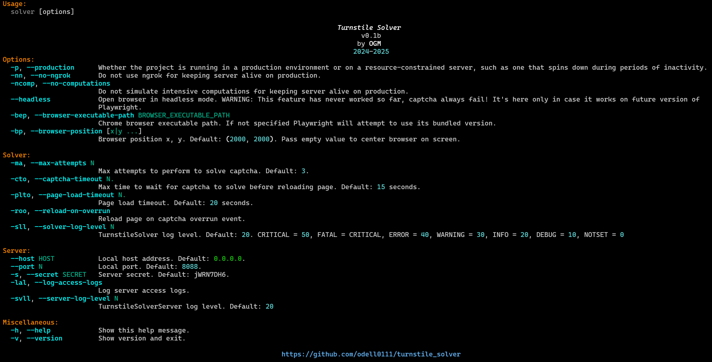
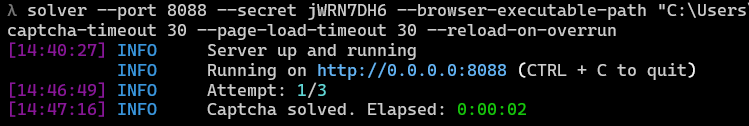
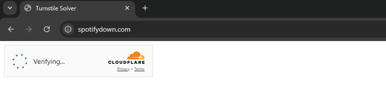

# Turnstile Solver

Python server to automatically solve Cloudflare Turnstile CAPTCHA with an average solving time of two seconds (counting with a fast internet connection).

PD: This repository was initially created for personal use. I've adjusted it for sharing, but it might still be slightly disorganized. Feel free to contribute, open issues, and request new features.

---

## Table of Content

- [Screenshots](#screenshots)
- [Install](#install)
    - [Patchright](#install-patchright-patched-chrome-browser)
- [How to use](#how-to-use)
    - [Run server](#run-server)
    - [Global proxy](#use-global-browser-proxy)
    - [Proxy parameters](#load-proxy-parameters-from-environment-variables-all-caps)
    - [Proxy file](#use-a-proxy-from-file-per-browser-context)
- [Get Token](#get-token)
    - [Curl](#curl)
    - [Python](#python)
- [Docker](./docker/README.md)
- [Disclaimer](#disclaimer)
- [Sponsor](#sponsor)
- [Donate](#donate)

---

## Screenshots

TODO: Update






---

## Install

```bash
pip install git+https://github.com/odell0111/turnstile_solver@main
```

### Install Patchright patched chrome browser

```bash
patchright install chrome
```

Note: You can also install chromium but chrome is [recommended by Patchright](https://github.com/Kaliiiiiiiiii-Vinyzu/patchright-python?tab=readme-ov-file#best-practice----use-chrome-without-fingerprint-injection)

---

## How to use

### Run server

```bash
solver
```

```bash
solver --port 8088 --secret jWRN7DH6 --browser-position --max-attempts 3  --captcha-timeout 30 --page-load-timeout 30 --reload-on-overrun
```

#### Use global browser proxy

```bash
solver --proxy-server http://myproxy.com:3128 --proxy-username user --proxy-password pass
```

##### Load proxy parameters from environment variables (all caps)

```bash
solver --proxy-server MY_PROXY_SERVER --proxy-username MY_PROXY_USERNAME --proxy-password MY_PROXY_PASSWORD
```

##### Use a proxy from file per browser context

```bash
solver --proxies myproxies.txt
```

### Get token

#### cURL

```bash
curl --location --request GET 'http://127.0.0.1:8088/solve' \
--header 'ngrok-skip-browser-warning: _' \
--header 'secret: jWRN7DH6' \
--header 'Content-Type: application/json' \
--data '{
    "site_url": "https://spotifydown.com",
    "site_key": "0x4AAAAAAAByvC31sFG0MSlp"
}'
```

#### Python

```python
import requests

SERVER_URL = "http://127.0.0.1:8088"

url = f"{SERVER_URL}/solve"

headers = {
  'ngrok-skip-browser-warning': '_',
  'secret': 'jWRN7DH6',
  'Content-Type': 'application/json'
}

json_data = {
  "site_url": "https://spotifydown.com",
  "site_key": "0x4AAAAAAAByvC31sFG0MSlp"
}

response = requests.get(
  url=url,
  headers=headers,
  json=json_data,
)

response.raise_for_status()
data = response.json()

# {
#   "elapsed": "2.641519",
#   "message": null,
#   "status": "OK",
#   "token": "0.MwOLQ3dg..."
# }

token = data['token']
print("Token:", token)

```

---

## 🐳 Container Management Guide
goto [./docker/README.md](./docker/README.md)

---

## Disclaimer

Use this project entirely at your own risk. I hold no responsibility for any negative outcomes, including but not limited to API blocking and IP bans

---

## Sponsor
**Need to elevate your project?**
Try **[CapSolver](https://www.capsolver.com/)**, an industry-leading RPA (Robotic Process Automation) service. From Cloudflare's anti-bot systems to hCaptcha, reCAPTCHA, and more, CapSolver delivers unmatched accuracy and speed to tackle even the toughest challenges. Trusted by developers worldwide for seamless automation.


<div align="center">
  <a href="https://www.g2.com/products/capsolver/reviews" target="_blank">
    
  </a>
  <a href="https://www.trustpilot.com/review/capsolver.com" target="_blank">
    
  </a>
  <a href="https://www.producthunt.com/products/capsolver-captcha-solver-service" target="_blank">
    
  </a>
  <a href="https://www.saashub.com/capsolver" target="_blank">
    
  </a>
  <a href="https://chromewebstore.google.com/detail/captcha-solver-auto-captc/pgojnojmmhpofjgdmaebadhbocahppod" target="_blank">
    
  </a>
  <a href="https://addons.mozilla.org/en-US/firefox/addon/capsolver-captcha-solver/?utm_source=addons.mozilla.org&utm_medium=referral&utm_content=search" target="_blank">
    
  </a>
</div>

---

## Donate

If you find my work useful and want to encourage further development, you can do so by donating

### [OxaPay](https://oxapay.com/donate/42319117)

### USDT (BEP20 - BSC)
`0x88046e6d0f2bf8629cd7fbd754e4e275083fc993`

### USDT (SOL - Solana)
`BL3QX5GtfXp8qha8PMLVwyud7gxB1aPE4Vsqotwscxsv`

### USDT (TRC20 - Tron)
`TMpXigKBghRQmgYD53KyuxS38FH516ermu`

### BTC
`1E9kw3FuaahfeproboNL7uvyBdjP9wY6CR`

### BTC (BEP20)
`0x88046e6d0f2bf8629cd7fbd754e4e275083fc993`

### TON
`UQCyCnWVYOmv97idVFZ4tIewToZacRhYVwfGNU658fN5w3Kl`

### Speed Lightning Address username
`bytechanger@speed.app`